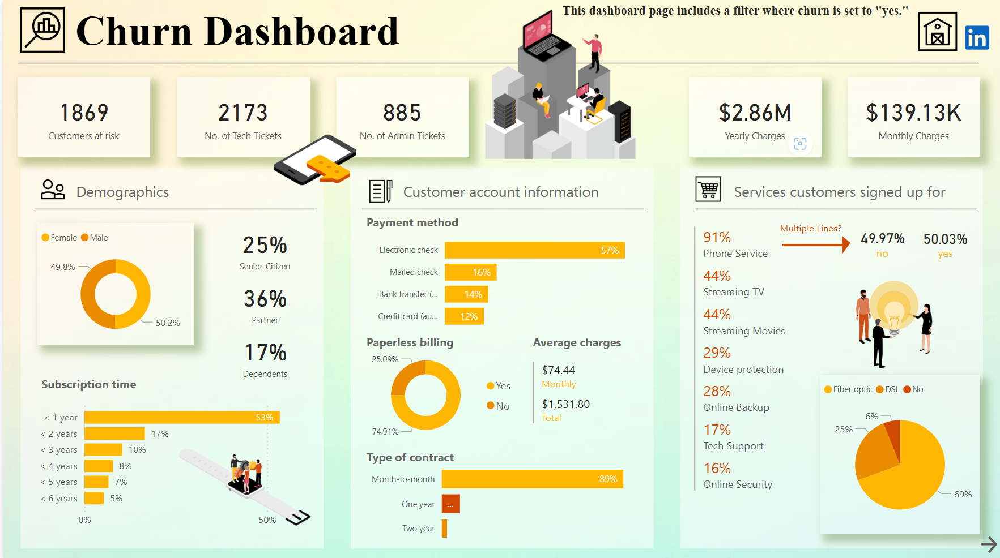
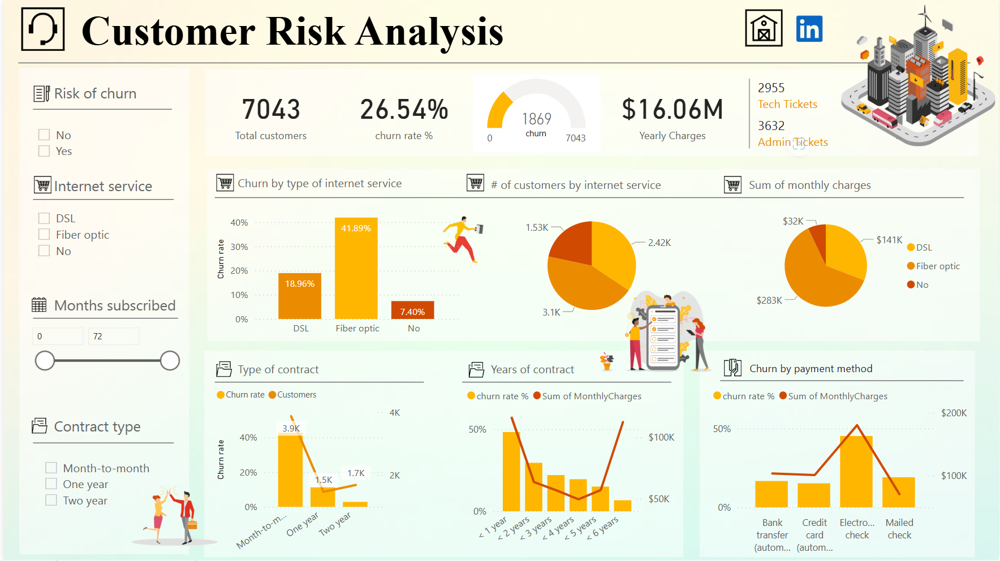

# 📊 Churn Analysis Power BI Dashboard

This project presents a feature-rich, interactive dashboard created using **Power BI** to analyze **customer churn behavior**. It provides a detailed view of churn patterns, risk segments, and financial implications—helping stakeholders make informed, data-driven decisions to reduce churn and boost customer retention.

---

## 🧾 Project Description

Customer churn is a major concern for subscription-based businesses. Retaining customers is more cost-effective than acquiring new ones. This dashboard explores the behaviors and attributes of over **7,000 customers** to understand:

- What factors contribute most to customer churn?
- Which customers are at the highest risk?
- How do demographics and usage patterns influence churn?
- What can businesses do to reduce churn?

The goal is to empower decision-makers with actionable insights to implement strategic retention initiatives.

---

## 📂 Contents

- `Churn_analysis.pbix` – Main Power BI dashboard file  
- `churn_dashboard.png` – Churn Dashboard screenshot  
- `customer_risk_analysis.png` – Customer Risk Analysis screenshot  

---

## 📈 Dashboard Overview

### 🔹 1. Churn Dashboard

Provides a bird's-eye view of the customer base and highlights financial exposure due to churn risk.

**Key Highlights:**
- 📌 **1,869** customers flagged as high churn risk  
- 💳 **$2.86M** total yearly charges | **$139.13K** monthly charges  
- 🔍 Filters by gender, senior citizen, partner/dependent status  
- 📡 Insights by billing type, payment method, service type  

---

### 🔹 2. Customer Risk Analysis

Dives deeper into churn trends across customer groups.

**Key Insights:**
- 🧮 **26.54%** overall churn rate among **7,043** customers  
- 📅 Highest churn observed in **month-to-month** contract holders  
- 💸 **Electronic check** payment method linked to higher churn  
- 📊 Strong churn correlation with low tenure and high monthly charges  

---

## 📊 Key Metrics & KPIs

| KPI                            | Description                                              | Value             |
|--------------------------------|----------------------------------------------------------|-------------------|
| Total Customers                | Total records analyzed                                   | 7,043             |
| Customers at Risk             | Customers flagged with high churn probability            | 1,869             |
| Churn Rate                     | Percentage of customers who left                         | 26.54%            |
| Total Monthly Charges          | Sum of all customers' monthly charges                    | $139,130          |
| Total Yearly Charges           | Projected yearly revenue from all customers              | $2.86M            |
| Avg. Monthly Charges (Churned) | Avg. monthly spend of churned customers                  | ~$74.44           |
| Avg. Tenure (Churned)          | Avg. months stayed by churned customers                  | ~17.7 months      |
| High Churn Segments            | Segments with highest churn rate                         | Month-to-month, Electronic Check |
| Low Churn Segments             | Segments with lowest churn rate                          | Two-year contracts, Bank transfer |

---

## 🛠 Built With

This project utilizes the full capabilities of Power BI:

- **Power BI Desktop** – Interactive data visualization  
- **Power Query Editor** – ETL operations for preparing data  
- **DAX (Data Analysis Expressions)** – Custom KPIs and calculations  
- **Custom visuals & charts** – For impactful storytelling  
- **Slicers & filters** – For segment-level drill-down analysis  

---

## 💼 Business Impact

✅ Identify high-risk customer segments to prioritize retention  
✅ Estimate potential revenue loss due to churn  
✅ Understand which services or demographics lead to higher churn  
✅ Empower marketing and operations teams to create targeted retention campaigns  

---

## 📊 Data Source

The dataset used for this project is based on the publicly available **Telco Customer Churn dataset**. It contains anonymized data about customer demographics, account info, and service usage.

---

